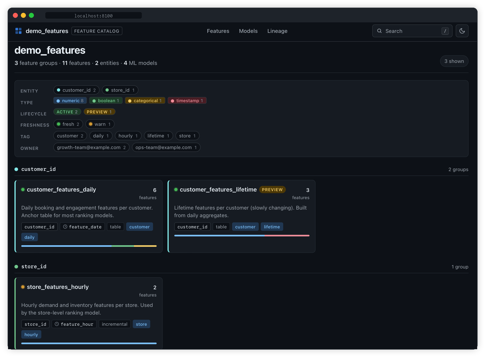

<div align="center">
  
</div>

<h1 align="center">dbt-features</h1>

<p align="center">
  <strong>Feature catalog for dbt projects, built for ML teams.</strong>
</p>

<p align="center">
  <a href="https://github.com/gauthierpiarrette/dbt-features/actions/workflows/test.yml"></a>
  <a href="https://gauthierpiarrette.github.io/dbt-features/"></a>
  <a href="https://www.python.org/downloads/"></a>
  <a href="https://github.com/gauthierpiarrette/dbt-features"></a>
  <a href="./LICENSE"></a>
</p>

<p align="center">
  <a href="https://gauthierpiarrette.github.io/dbt-features/"><strong>Live demo</strong></a> ·
  <a href="docs/"><strong>Docs</strong></a>
</p>

<p align="center">
  <a href="https://gauthierpiarrette.github.io/dbt-features/">
    
  </a>
</p>

---

## Install

```bash
pip install dbt-features
```

For warehouse enrichment (freshness, row counts, null %), install the extra for your warehouse:

```bash
pip install 'dbt-features[duckdb]'       # local / dbt-duckdb
pip install 'dbt-features[postgres]'     # Postgres
pip install 'dbt-features[redshift]'     # Redshift
pip install 'dbt-features[snowflake]'    # Snowflake
pip install 'dbt-features[bigquery]'     # BigQuery
```

Requires Python 3.10+. The base install does not depend on `dbt-core`.

## Quickstart

Try it with no setup - bundled sample data, served on a free port:

```bash
dbt-features demo
```

On your dbt project:

```bash
dbt parse
dbt-features build --connection my_profile --output ./catalog
dbt-features serve --output ./catalog
```

## What it does

- Reads your dbt manifest and finds models marked `is_feature_table: true`.
- Renders a static HTML site: feature groups, features, lineage, ML model consumers.
- With `--connection`, pulls freshness, row counts, null %, and cardinality from the warehouse.

> Read-only. No backend, no database.

## Docs

- **[Metadata schema](docs/schema.md)** - how to mark a model as a feature table
- **[Warehouse enrichment](docs/enrichment.md)** - freshness, row counts, profile examples
- **[dbt package](docs/dbt-package.md)** - compile-time validation
- **[Deploying the catalog](docs/deploy.md)** - GitHub Pages, S3, Netlify

## Development

```bash
git clone https://github.com/gauthierpiarrette/dbt-features
cd dbt-features
python -m venv .venv && source .venv/bin/activate
pip install -e ".[dev]"
pytest
```

## License

Apache 2.0. Not affiliated with dbt Labs.
